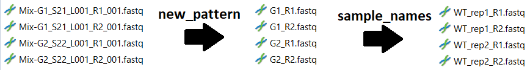

# HW 8. Регулярные выражения
> *This is the repo for the eights homework of the BI Python 2023 course*

### Homework description

Регулярные выражения - одна из самых важных тем в биоинформатике. Например, для парсинга всяких файлов. Очень часто их используют в `grep` или `sed` чтобы добиваться каких-то сложных результатов. Ну а в этом домашнем задании попрактикуемся с какими-нибудь базовыми вещами.

#### Задание

Как всегда, состоит из нескольких частей.

0) **Клятва**

    Я клянусь что в этом задании я не буду использовать ИИ (ChatGPT, Copilot, телеграмм-боты, YandexGPT,  ruDALL-E, Я.Автопоэт, Балабоба и др.). 

1) **Короткие задачки чтобы набить руку.** 

    Вам дан ноутбук `HW8_RegExp_Tasks.ipynb`. Откройте его (через Jupyter / VSCode / Google Colab) и в каждом задании подставьте необходимый pattern (в поле `pattern = ...` вместо `...`). Все остальное трогать запрещено!

2) **RegExp-функции**

    Создайте модуль (скрипт) в котором будут лежать следующие функции (только их определения, не надо их вызывать):
   - Функцию которая осуществляет перевод с русского на "солёный язык" ([Wiki](https://ru.wikipedia.org/wiki/%D0%9F%D0%BE%D1%80%D0%BE%D1%81%D1%8F%D1%87%D1%8C%D1%8F_%D0%BB%D0%B0%D1%82%D1%8B%D0%BD%D1%8C#%D0%A0%D1%83%D1%81%D1%81%D0%BA%D0%B8%D0%B9_%D1%8F%D0%B7%D1%8B%D0%BA)).
   - Функция которая принимает на вход путь до файла с текстом + аккордами песни и возвращает имеющиеся там аккорды (set). Файл пример `song.txt` приложен в папке `data`.
   - Функцию `rename_files` которая осуществляет групповое переименование файлов либо по паттерну, либо по словарю названий образцов, либо последовательно по обоим механизмам. На вход подаются следующие параметры:
     - `dir` - название директории в которой выбирать файлы (приложена папка `fastqs`)
     - `pattern` - паттерн, по которому выбирать файлы из директории (и который подлежит замене)
     - `new_pattern` - паттерн на который заменяется названия файлов. Если отсутствует, то переименовая по паттерну не происходит, но при этом исходный паттерн требуется для выбора файлов
     - `sample_names` - словарь, который задает правила переименования образцов (пример: `{'G1': 'WT_rep1', 'G2': 'WT_rep2'}`). Применяется после замены паттерна (см. скриншот)
     - `to_replace` - переименовывать файлы с удалением исходных, или просто с копированием (True / False), по умолчанию False

3) **Демонстрируем наши заслуги**

    В ноутбуке  `HW8_RegExp_Tasks.ipynb` в конце сделайте импорт вашей функции `rename_files`, подайте ей на вход папку `fastqs` и правильно задайте остальные аргументы чтобы сделать там переименования такие как на скриншоте выше. По итогу работы должны создаться новые файлы (старые удалять не надо). 

4)  **Дополнительное задание**

    Я проверяю ваше задание под музыку. Скиньте 1-2 песни, под которые проверять именно вашу домашку:). Баллы за это задание удвоятся, если там будет песня в вашем исполнении.

### Доп. моменты:
- Не забывайте про докстринги, аннотации, замените это README своим (можно не очень большим). Опишите что произошло в этом репозитории.
- Можно использовать только стандартную библиотеку. 
- Советую всё проверять в [regex101.com](regex101.com), можете выбрать в меню слева python (и русский язык в настройках)
- Автотестов на GitHub в этом ДЗ нет, но вы можете прогнать линтеры на качество кода локально (как в ДЗ №3, подробнее читайте [тут](https://plausible-cannon-091.notion.site/Code-auto-checks-02b2ea69c1d545fca07b50ce5933ed5f?pvs=4)). 

### Форма сдачи

Сделайте пуш. Прикрепите ссылку на свой pull-request Google Class.

### Pазбалловка

- За каждую задачку из части 1 по 0.4 балла, суммарно **6 баллов**
- За каждую функцию по 1 баллу, суммарно **3 балла**
- За демонстрацию работы `rename_files` - **1 балл** 

Дополнительные баллы: 
- За клятву из пункта 0 - **0.4 доп. балла** (отметьте в README)
- 2 доп. задачки в ноутбуке по 0.4 балла, суммарно **0.8 доп. баллов**
- В README приложена музыка - **0.4 доп. балла** (0.8 доп. баллов если в вашем исполнении)

### **Предполагаемый учебный результат**

Это задание позволит вам на практике познакомиться с регулярными выражениями, а также написать функции которые возможно кому-то из вас будут полезны (особенно тем кто работает с иллюминой).

Удачи! ✨✨
